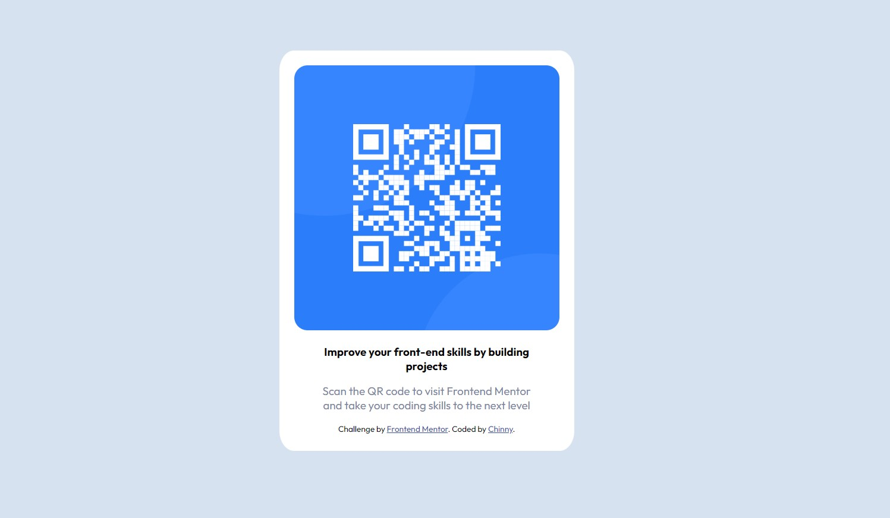

# Frontend Mentor - QR code component solution

This is a solution to the [QR code component challenge on Frontend Mentor](https://www.frontendmentor.io/challenges/qr-code-component-iux_sIO_H). Frontend Mentor challenges help you improve your coding skills by building realistic projects. 

## Table of contents

- [Overview](#overview)
  - [Screenshot](#screenshot)
- [My process](#my-process)
  - [Built with](#built-with)
  - [What I learned](#what-i-learned)
  - [Continued development](#continued-development)
  - [Useful resources](#useful-resources)
- [Author](#author)


## Overview

### Screenshot




## My process
The first thing I did was take a look at all the designs for desktop and for mobile. I saw that they were mostly similar so I focused first on recreating the desktop version of the QR code.
### Built with

- Semantic HTML5 markup
- CSS custom properties
- Flexbox


### What I learned

Use this section to recap over some of your major learnings while working through this project. Writing these out and providing code samples of areas you want to highlight is a great way to reinforce your own knowledge.

To see how you can add code snippets, see below:

```html
<h1>Some HTML code I'm proud of</h1>
```
```css
@media (max-width: 1440px){

      .card {
        height: 400px;
        padding: 15px;
      }

      img {
        height: 250px;
      }

      .content {
        width: 250px;
      }
    }
```

### Continued development

I need to keep practicing with layouts like Flexbox, because that is what caused me the most confusion. I made the card div a flexbox instead of the body, which meant that the text was appearing to the side and I wasn't able to align everything the way I wanted.

### Useful resources

The most helpful resource for me was W3Schools. Once I realised that this was a card layout, it helped me to figure out how to create the layout necesary. Seeing what wasn't on the card they made helped me see the mistake that I was making (I was using flexbox to try and centre the card, but I was using it in the wrong section so the card kept on appearing wrong).


## Author

- Website - [Chinny](https://www.your-site.com)
- Frontend Mentor - [@chinnyui](https://www.frontendmentor.io/profile/chinnyui)
- Twitter - [@yourusername](https://www.twitter.com/yourusername)
Github - [@chinnyui](https://github.com/chinnyui)

